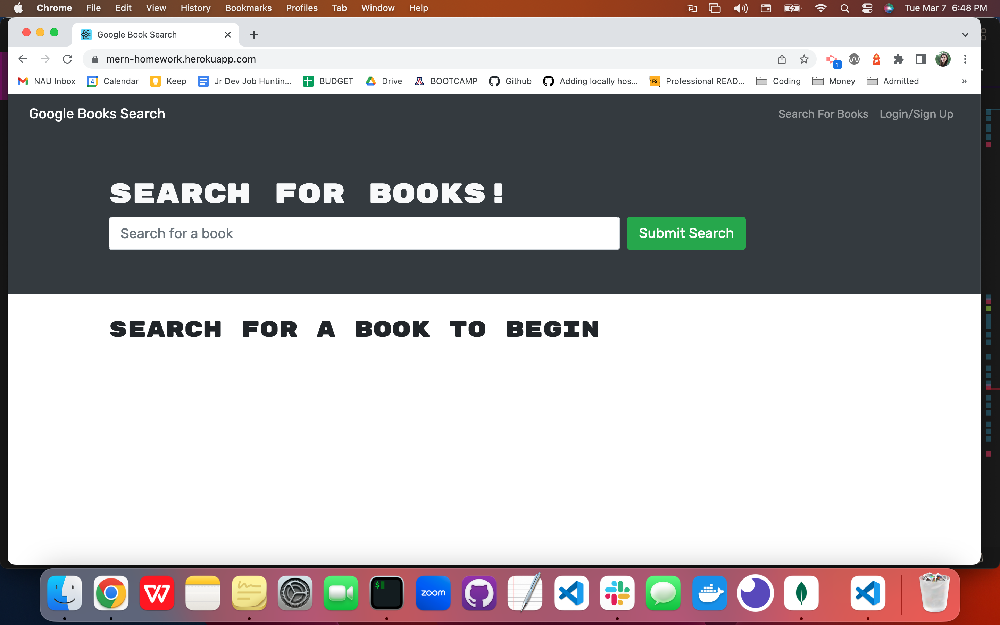
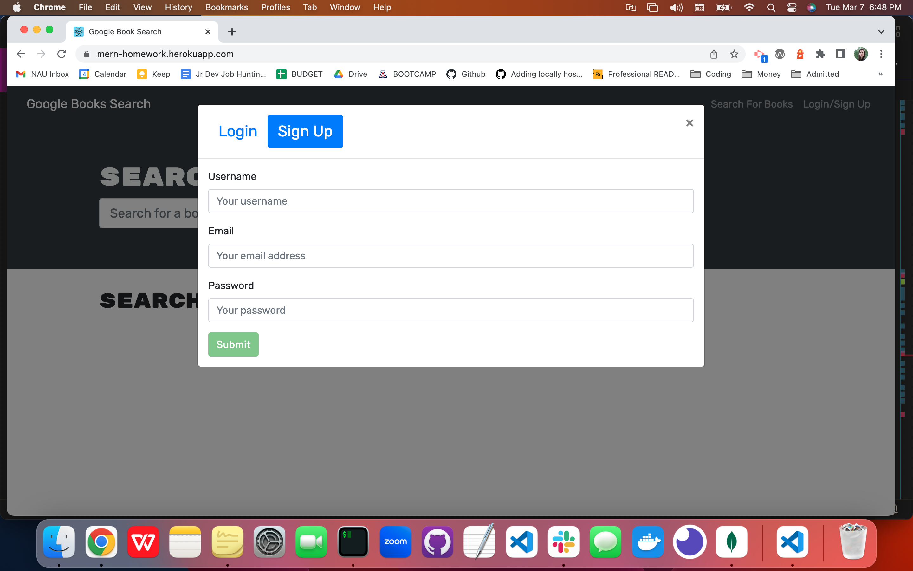
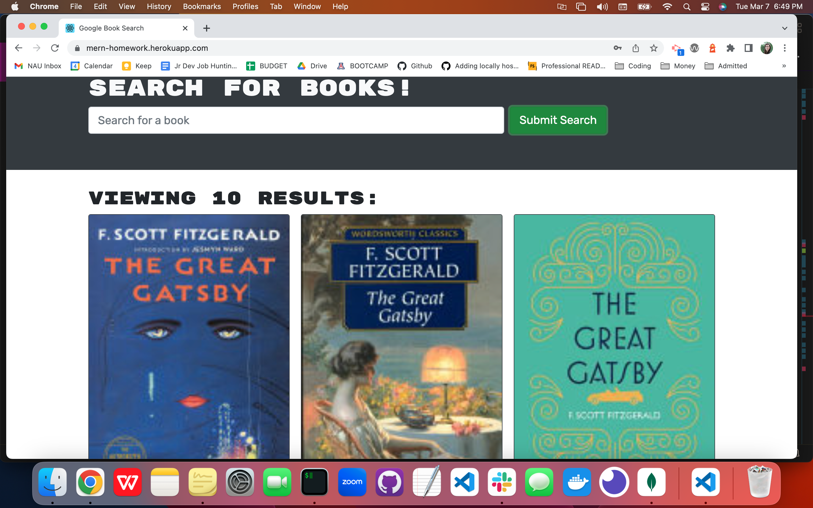
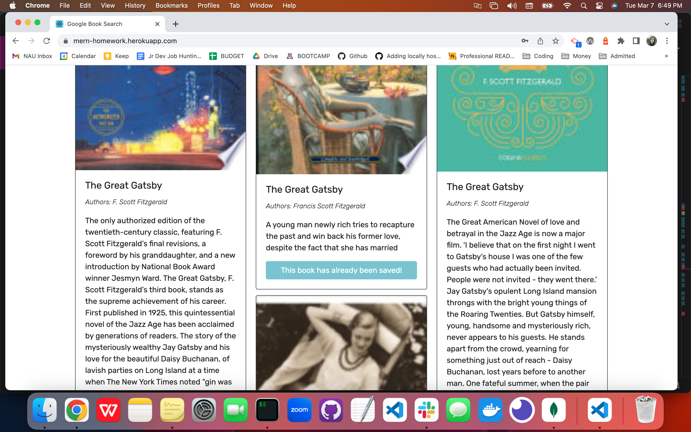
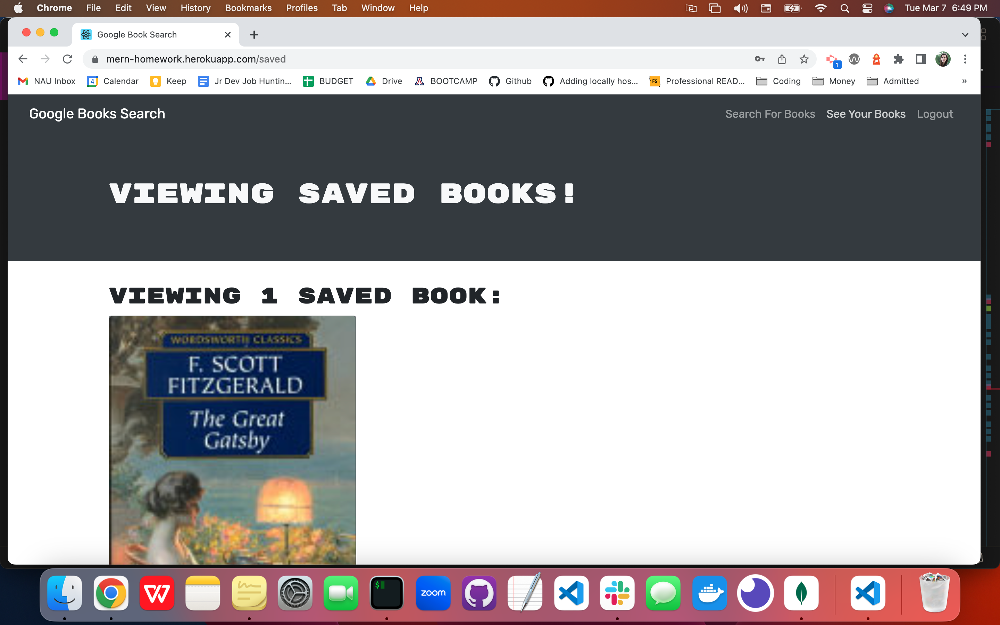
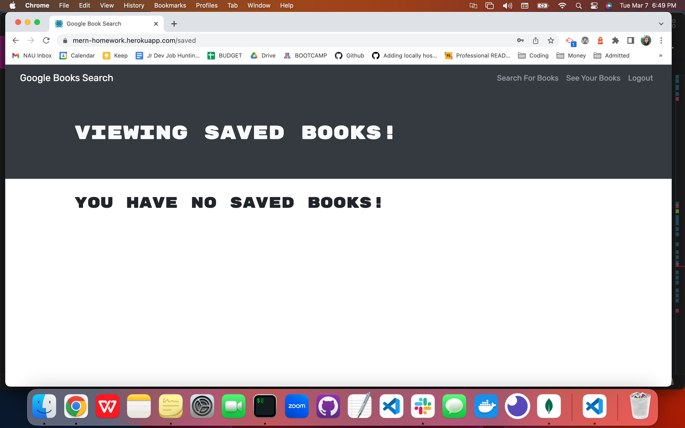

# MERN Homework: Book Search Engine

## Description

- Deployed link: https://mern-homework.herokuapp.com/
- Github repository: https://github.com/maggierdelaney/MERN-homework

This assignment provided starter code which had to be built upon to get the application running. This application meets the following acceptence criteria:

- GIVEN a book search engine, WHEN I load the search engine, THEN I am presented with a menu with the options Search for Books and Login/Signup and an input field to search for books and a submit button
- WHEN I click on the Search for Books menu option, THEN I am presented with an input field to search for books and a submit button
- WHEN I am not logged in and enter a search term in the input field and click the submit button, THEN I am presented with several search results, each featuring a book’s title, author, description, image, and a link to that book on the Google Books site
- WHEN I click on the Login/Signup menu option, THEN a modal appears on the screen with a toggle between the option to log in or sign up
- WHEN the toggle is set to Signup, THEN I am presented with three inputs for a username, an email address, and a password, and a signup button
- WHEN the toggle is set to Login, THEN I am presented with two inputs for an email address and a password and login button
- WHEN I enter a valid email address and create a password and click on the signup button, THEN my user account is created and I am logged in to the site
- WHEN I enter my account’s email address and password and click on the login button,THEN I the modal closes and I am logged in to the site
- WHEN I am logged in to the site, THEN the menu options change to Search for Books, an option to see my saved books, and Logout
- WHEN I am logged in and enter a search term in the input field and click the submit button, THEN I am presented with several search results, each featuring a book’s title, author, description, image, and a link to that book on the Google Books site and a button to save a book to my account
- WHEN I click on the Save button on a book, THEN that book’s information is saved to my account
- WHEN I click on the option to see my saved books, THEN I am presented with all of the books I have saved to my account, each featuring the book’s title, author, description, image, and a link to that book on the Google Books site and a button to remove a book from my account
- WHEN I click on the Remove button on a book, THEN that book is deleted from my saved books list
- WHEN I click on the Logout button, THEN I am logged out of the site and presented with a menu with the options Search for Books and Login/Signup and an input field to search for books and a submit button 

## Table of Contents

- [Installation](#installation)
- [Usage](#usage)
- [Credits](#credits)
- [License](#license)

## Installation

To start, I installed `npm install apollo-server-express@2.15.0` to set up an Apollo Server to use GraphQL queries and mutations to fetch and modify the data, replacing the existing RESTful API from the starter code.

I modified the existing authentication middleware so that it worked in the context of a GraphQL API.

I created an Apollo Provider so that requests could communicate with the Apollo Server.

The application is deployed to Heroku with a MongoDB database using MongoDB Atlas.

## Usage

When you navigate to the page, you will be asked to login or sign up:

You will then be able to type a book into the search bar, and results will appear below:

If you click to save the book, it will then change the button message, and the book will save to your "See Your Books" tab.

If you scroll down, there is an option to delete the book, once deleted you will see a "no saved books" message.

## Credits

Nodejs
npm
Express
Apollo
React
Mongodb

## License

Distributed under MIT License.

